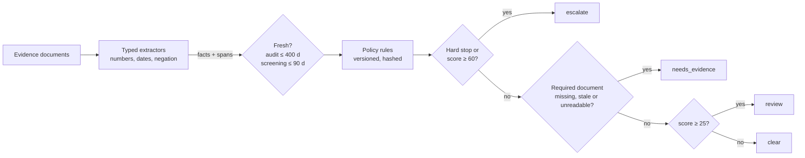

# Risk Agent Workbench

[](https://github.com/asher0913/risk-agent-workbench/actions/workflows/ci.yml)


[](LICENSE)

A counterparty-review engine that reads five kinds of evidence (payment ledger, company registry,
audit report, sanctions screening, media search), applies a **versioned** risk policy, and returns
`clear`, `review`, `escalate` or `needs_evidence`, with every finding **cited to a character span**
of a source document. It is evaluated against keyword baselines on 1,000 seeded synthetic cases,
and again on 1,000 cases written in phrasing the extractors have never seen.

The design goal is the one that matters in regulated review: **never clear a risky case by
accident.** A missing, stale or unreadable required document produces `needs_evidence`, not a guess.

## Results

### Development phrasing

| System | Accuracy | Risky cases cleared | Clean cases escalated | Guessed without evidence | Sent back for evidence |
|---|---:|---:|---:|---:|---:|
| keyword baseline | 16.2% | 11.9% | 95.9% | 39.9% | 0% |
| keyword + negation (NegEx-style) | 41.4% | **51.9%** | 3.8% | 97.2% | 0% |
| structured extraction, no abstention | 71.9% | 0% | 0% | 100% | 0% |
| **structured extraction + abstention** | 100%* | **0%** | 0% | **0%** | 28.1% |

\*By construction: the extractors were written against these phrasings and ground truth applies the
same policy to the true facts. The informative numbers are the baselines' failure modes and what
abstention changes, not the 100%.

- **Keywords escalate almost everything.** "No match against sanctions lists" contains *match*,
  and "unqualified opinion" contains *qualified opinion*, so 96% of clean counterparties escalate.
- **Handling negation swaps one failure for a worse one.** A negation window fixes those false
  alarms, but a keyword cannot read "97 days past due" versus "12 days", so over half of the
  genuinely risky cases are cleared.
- **Reading values is necessary but not sufficient.** Structured extraction gets every decidable
  case right, yet without abstention it decides the 28% of cases that lack a required fresh
  document as if the gap meant "no risk".

### Held-out phrasing

Every evidence template is replaced ("Arrears of 120 days on the account", "Except for the matter
described, the statements present fairly", "Name screening: 0.93 similarity with a designated party").

| System | Accuracy | Risky cases cleared | Sent back for evidence |
|---|---:|---:|---:|
| keyword baseline | 32.9% | **100%** | 0% |
| keyword + negation | 32.9% | **100%** | 0% |
| structured extraction, no abstention | 32.9% | **100%** | 0% |
| **structured extraction + abstention** | 28.1% | **0%** | 100% |

This is the result the project exists to show. Pattern-based extraction does not generalise to new
phrasing, and every system that treats "found nothing" as "nothing wrong" silently clears all 185
risky counterparties. The abstaining system treats an unreadable document like a missing one, so
it fails **closed**: it sends every case to a human, which is useless for throughput but safe. The
natural next step is a learned (or LLM) extractor behind the same interface, where this harness
measures how much of the held-out set it can decide without ever clearing a risky case.

### Policy change impact (shadow run)

Policy `2026.2` tightens the past-due bands (61+ days → 40 points, 31+ → 25), doubles the
ownership-change window to 365 days and lowers the screening review threshold from 0.80 to 0.75.
Before rollout, `riskbench impact` replays all 1,000 development cases under both versions:

| Transition | Cases |
|---|---:|
| clear → review | 88 |
| review → escalate | 18 |
| needs_evidence → escalate | 11 |
| clear → escalate | 6 |
| **decisions changed** | **123 (12.3%)** |

Escalations rise from 185 to 220 (+19%) and reviews from 193 to 263 (+36%): the staffing cost of the
change, known before it ships. Each moved case is listed with the rules that fired under both
versions (for example case c0036 below: `past_due>=31d` → `past_due>=61d, ownership_change<=365d`, score 20 → 65).

## How a decision is made



Order matters: evidence that already justifies escalation is acted on even when other documents
are missing, so abstention never delays an obvious escalation.

```text
$ riskbench review c0036 --policy 2026.2
[c0036-ledger] (ledger, issued 2026-06-14) 2 invoices are past due, the oldest by 66 days.
[c0036-registry] (registry, issued 2026-06-02) Controlling shareholder replaced on 08 September 2025.
[c0036-audit] (audit, issued 2026-02-17) Clean audit opinion for FY2026.
[c0036-screening] (screening, issued 2026-06-13) Screening complete: no match found.
[c0036-media] (media, issued 2026-06-26) No adverse media found.
{"decision": "escalate", "score": 65,
 "findings": [
   {"rule": "past_due>=61d", "points": 40, "doc_id": "c0036-ledger",
    "span": [15, 46], "quote": "past due, the oldest by 66 days"},
   {"rule": "ownership_change<=365d", "points": 25, "doc_id": "c0036-registry",
    "span": [12, 53], "quote": "shareholder replaced on 08 September 2025"}],
 "policy": "342fa2b57086", ...}
```

Under 2026.1 the same case scores 20 and clears: 66 days falls in the 31–90 band, and a change of
control 295 days ago is outside the 180-day window.

- **Citations are verifiable.** Each finding carries `doc_id`, `span` and `quote`; the evaluation
  re-slices every source document and checks that the span reproduces the quote (941 of 941).
- **Policies are content-addressed.** A decision records the SHA-256 prefix of the exact policy
  that produced it, and `Policy.diff` lists changed parameters, so an audit can reproduce any past
  decision.

## Usage

```bash
pip install -e '.[dev]'

riskbench evaluate --out results/evaluation.json   # both suites, all four systems
riskbench impact --out results/policy_impact.json  # shadow-run 2026.2 against 2026.1
riskbench review c0036 --policy 2026.2              # one case, its evidence, the cited decision
```

## Tests

`pytest -q` runs 15 tests, covering negation and the "unqualified" trap, past-due numbers in three
phrasings, dates in two formats, hard stops overriding missing documents, abstention on missing,
stale and unreadable evidence, citation spans that reproduce their quotes, content-addressed and
diffable policies, deterministic generation, the guarantee that the abstaining system never
clears a risky case on either suite, impact bookkeeping, and the CLI.

## Limitations

- Cases and phrasings are synthetic, and the policy is illustrative, not any institution's
  credit or sanctions policy.
- Extraction is pattern based by design, to make the generalisation failure measurable.
- One document per kind and no conflicting evidence; real files contain several ledgers or
  screenings that disagree, which calls for explicit conflict resolution.

## License

MIT
