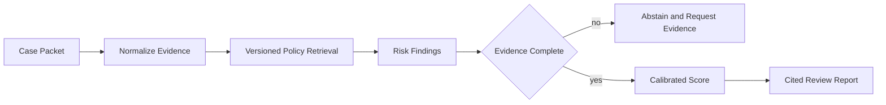

# Risk Agent Workbench

An evidence-grounded, versioned decision workflow for reviewing synthetic commercial-risk cases with traceable rules, missing-evidence checks, and calibrated evaluation.

This repository implements an original, laptop-scale reference system for a
production problem that repeatedly appears in strong AI/ML/software-engineering
portfolios. It focuses on architecture, failure handling, evaluation, and
reproducibility instead of claiming access to proprietary infrastructure.

## What is implemented

- Versioned policy knowledge base with immutable snapshots
- Rule and semantic-style keyword retrieval over case evidence
- Multi-step analysis trace with source citations for every finding
- Missing-evidence gates and abstention instead of unsupported conclusions
- Fixture-level acceptance, coverage, and false-alert evaluation

## Architecture



## Quick start

```bash
python -m venv .venv
source .venv/bin/activate
python -m pip install -e .
python -m unittest discover -s tests -v
PYTHONPATH=src python src/risk_agent_workbench/core.py
```

The demo prints a self-contained JSON report from seeded synthetic fixtures;
wall-clock latency values are machine-dependent. It is safe to run offline and
does not require credentials, paid APIs, GPUs, or employer data.

## Evaluation contract

All sample cases are fictional. The evaluator compares deterministic findings with fixture labels and reports rule coverage, decision accuracy, and false-alert rate. This is an engineering demonstrator, not financial advice or a production underwriting model.

## Repository layout

- `src/risk_agent_workbench/core.py` - executable reference implementation
- `tests/test_core.py` - deterministic regression and failure-path tests
- `benchmark-report.json` - checked-in output from the deterministic demo
- `.github/workflows/ci.yml` - clean-install CI on Python 3.12

## Scope and provenance

The problem definition was inspired by recurring engineering patterns observed
while reviewing a large resume corpus. All naming, source code, fixtures, and
documentation in this repository are original. Reported demo numbers are local
synthetic measurements, not production claims. The system is intentionally
compact so reviewers can inspect every design decision.

## License

MIT
